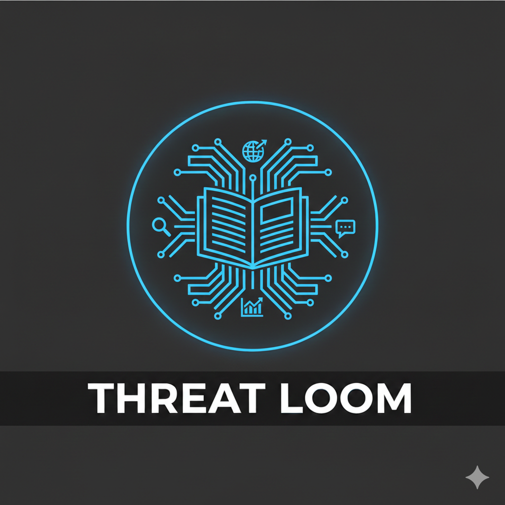

<p align="center">
  
</p>

# Threat Loom

AI-powered threat news analysis platform — aggregation, summarization, and forecasting.

Threat Loom automatically collects cybersecurity articles from RSS feeds and research libraries, generates structured AI summaries with MITRE ATT&CK mapping animation, and provides natural language search and trend forecasting over your collected data.

**[Documentation](https://nikhilh-20.github.io/ThreatLoom/)**

<video src="https://github.com/user-attachments/assets/f718a422-508c-40f5-b795-c62920710c6b" controls></video>

## Features

- **Feed Aggregation** — Ingests from 13 pre-configured security feeds (The Hacker News, BleepingComputer, Krebs on Security, CISA, etc.) plus Malpedia research. LLM-based relevance filtering removes noise.
- **AI Summarization** — Produces structured summaries with executive overview, novelty assessment, technical details, mitigations, and 3-8 categorization tags aligned to MITRE ATT&CK. Supports OpenAI and Anthropic providers.
- **Attack Flow Visualization** — Interactive kill chain timeline showing phase-by-phase attack sequences with MITRE tactic/technique mapping and progressive reveal.
- **Semantic Search** — RAG-powered chat interface. Ask questions in natural language and get answers grounded in your article database with citation cards.
- **Historical Trend Analysis** — Multi-pass LLM analysis generating quarter-by-quarter and year-by-year reports for each threat category, with cross-period correlation. Results are cached and displayed in collapsible panels.
- **Trend Forecasting** — Category-level trend + 3-6 month forecast. Drill into specific threat actors, malware families, and offensive tooling. Cost estimate shown before generation; actual cost shown after.
- **Time-Period Filter** — Filter the entire feed view and all category analysis by 24 h, 7 d, 30 d, or 90 d lookback with one click.
- **Email Notifications** — Per-article email alerts with the full structured analysis (executive summary, novelty, details, mitigations) and a link to the original source. Configure any SMTP provider (Gmail, Outlook, SendGrid). Uses only Python stdlib — no extra dependencies.
- **Automatic Categorization** — Articles are sorted into 9 threat categories (Malware, Vulnerabilities, Threat Actors, Phishing, Supply Chain, etc.) with entity-level subcategories for 300+ MITRE ATT&CK groups and software families.

## Requirements

- Python 3.10+
- OpenAI API key (for summarization, embeddings, and intelligence search) **or** Anthropic API key (for summarization only; embeddings still require OpenAI)
- Malpedia API key (optional, for research article ingestion)

## Quick Start

### Clone and install

```bash
git clone https://github.com/nikhilh-20/ThreatLoom.git
cd ThreatLoom
python -m venv venv
```

Activate the virtual environment:

```bash
# Linux / macOS
source venv/bin/activate

# Windows
venv\Scripts\activate
```

Install dependencies:

```bash
pip install -r requirements.txt
```

### Windows one-click

Double-click `run.bat` — it creates a virtual environment, installs dependencies, and launches the app automatically.

### Docker

```bash
OPENAI_API_KEY=sk-proj-your-key docker compose up
```

Or set the key in `docker-compose.yml` and run `docker compose up`. The app will be available at `http://localhost:5000`. Data (database and config) persists in the local `./data` directory, shared between standalone and Docker modes.

See [Environment variables](#environment-variables) below for all supported options.

### Run (without Docker)

```bash
python app.py
```

The app initializes the database, syncs feed sources, starts the background scheduler, and opens your browser to the dashboard (port 5000 by default, auto-selects next available if taken).

## Configuration

On first run, a `data/config.json` file is created with defaults. You can edit it directly or use the Settings page in the web UI.

```json
{
  "openai_api_key": "",
  "openai_model": "gpt-4o-mini",
  "anthropic_api_key": "",
  "anthropic_model": "claude-haiku-4-5-20251001",
  "llm_provider": "openai",
  "fetch_interval_minutes": 30,
  "malpedia_api_key": "",
  "feeds": [
    {"name": "The Hacker News", "url": "https://feeds.feedburner.com/TheHackersNews", "enabled": true},
    {"name": "BleepingComputer", "url": "https://www.bleepingcomputer.com/feed/", "enabled": true},
    ...
  ]
}
```

### Environment variables

API keys and server settings can be configured via environment variables, which take precedence over `config.json`. This is the recommended approach for Docker deployments.

| Variable | Default | Description |
|---|---|---|
| `OPENAI_API_KEY` | — | OpenAI API key (overrides `config.json`) |
| `ANTHROPIC_API_KEY` | — | Anthropic API key (overrides `config.json`; used when `llm_provider` is `anthropic`) |
| `MALPEDIA_API_KEY` | — | Optional Malpedia API key (overrides `config.json`) |
| `HOST` | `127.0.0.1` | Bind address (`0.0.0.0` in Docker) |
| `PORT` | auto-detect | Listen port (`5000` in Docker) |
| `DATA_DIR` | `./data` | Directory for `config.json` and `threatlandscape.db` (`/app/data` in Docker) |
| `SMTP_HOST` | — | SMTP server hostname (e.g. `smtp.gmail.com`) |
| `SMTP_PORT` | `587` | SMTP server port |
| `SMTP_USERNAME` | — | SMTP login username |
| `SMTP_PASSWORD` | — | SMTP login password or app password |
| `NOTIFICATION_EMAIL` | — | Recipient email (auto-enables notifications when set) |

### Setting up your API key

1. Open the app and navigate to **Settings**
2. Select your LLM provider (**OpenAI** or **Anthropic**)
3. Enter your API key and click **Test** to verify
4. Select your preferred model (see tables below)
5. Click **Save Settings**

> Embeddings for semantic search always use OpenAI (`text-embedding-3-small`). An OpenAI key is required even when using Anthropic for summarization.

### Adding feeds

Add custom RSS/Atom feeds through the Settings page or directly in `config.json`:

```json
{"name": "My Custom Feed", "url": "https://example.com/feed.xml", "enabled": true}
```

### Default feeds

| Source | Enabled |
|---|---|
| The Hacker News | Yes |
| BleepingComputer | Yes |
| Krebs on Security | Yes |
| SecurityWeek | Yes |
| Dark Reading | Yes |
| CISA Alerts | Yes |
| Sophos News | Yes |
| Infosecurity Magazine | Yes |
| HackRead | Yes |
| SC Media | Yes |
| Cyber Defense Magazine | No |
| The Record | Yes |
| Schneier on Security | Yes |

### LLM models

**OpenAI**

| Model | Best for |
|---|---|
| `gpt-4o-mini` | Daily use — fast, cost-effective (default) |
| `gpt-4o` | Higher quality summaries and insights |
| `gpt-4-turbo` | Complex analysis tasks |
| `gpt-3.5-turbo` | Budget-conscious processing |

**Anthropic**

| Model | Best for |
|---|---|
| `claude-haiku-4-5-20251001` | Daily use — fast, cost-effective (default) |
| `claude-sonnet-4-6` | Higher quality summaries and insights |
| `claude-opus-4-6` | Highest quality, complex analysis |

Embeddings always use `text-embedding-3-small` (1536 dimensions) regardless of provider.

## How It Works

The app runs an automated pipeline on a configurable interval (default: every 30 minutes). You can also trigger it manually from the dashboard.

```
RSS Feeds / Malpedia
       |
 Relevance Filter (LLM batch classification)
       |
 Scrape Article Content (trafilatura)
       |
 AI Summarization (structured JSON → markdown)
       |
 Email Notification (per article, if enabled)
       |
 Vector Embeddings (text-embedding-3-small)
       |
 Browse · Search · Forecast
```

**Pipeline stages:**

1. **Fetch** — Download RSS/Atom entries from enabled feeds, filter by date, deduplicate by URL, batch-classify relevance via LLM
2. **Malpedia** — Parse BibTeX bibliography, same relevance filtering (requires API key)
3. **Scrape** — Download article HTML using browser-like headers, extract text with trafilatura (30s timeout per article)
4. **Summarize** — Generate structured summary with executive overview, novelty, details, mitigations, tags, and attack flow (12,000 char input limit)
5. **Notify** — Send email alert with the full analysis for each summarized article (if enabled; failures never block the pipeline)
6. **Embed** — Generate 1536-dim vectors for semantic search (batches of 50)

Each stage only processes new/unprocessed articles. The pipeline is non-blocking — browse while it runs.

## Project Structure

```
app.py                # Flask web server, all routes and API endpoints
config.py             # Configuration loading/saving (config.json)
database.py           # SQLite interface, schema, categorization engine
scheduler.py          # Background pipeline orchestration (APScheduler)
feed_fetcher.py       # RSS/Atom feed ingestion with relevance filtering
malpedia_fetcher.py   # Malpedia BibTeX research ingestion
article_scraper.py    # HTML download and text extraction (trafilatura)
summarizer.py         # LLM summarization, relevance checks, trend/forecast insights
llm_client.py         # LLM provider abstraction (OpenAI and Anthropic)
cost_tracker.py       # Per-session token and cost tracking
notifier.py           # Email notifications via SMTP (stdlib only)
embeddings.py         # Vector embedding generation and cosine similarity search
intelligence.py       # RAG chat system (retrieval + LLM response)
mitre_data.py         # MITRE ATT&CK entity lookup tables
requirements.txt      # Python dependencies
run.bat               # Windows one-click launcher
Dockerfile            # Container image definition
docker-compose.yml    # Docker Compose service config
config.json           # User configuration (created on first run)
threatlandscape.db    # SQLite database (created on first run)
templates/            # Jinja2 HTML templates (dashboard, article, intelligence, settings)
static/               # CSS (dark theme), JavaScript (client-side logic), and images
docs/                 # MkDocs documentation source
mkdocs.yml            # MkDocs configuration
```

## API Endpoints

All endpoints return JSON. Base URL: `http://127.0.0.1:<port>`

### Articles

| Method | Endpoint | Description |
|---|---|---|
| GET | `/api/articles` | Paginated article list (params: `source_id`, `search`, `tag`, `page`, `limit`) |
| GET | `/api/articles/<id>` | Single article with full summary |
| GET | `/api/articles/categorized` | Articles grouped by threat category (params: `days`) |

### Sources & Stats

| Method | Endpoint | Description |
|---|---|---|
| GET | `/api/sources` | All configured feed sources |
| GET | `/api/stats` | Database statistics (articles, sources, summaries, 24h count) |

### Pipeline Control

| Method | Endpoint | Description |
|---|---|---|
| POST | `/api/refresh` | Trigger manual pipeline (body: `{"days": 1, "since_last_fetch": false}`) |
| GET | `/api/refresh-status` | Poll refresh status (`{"is_refreshing": bool}`) |
| POST | `/api/clear-db` | Delete all articles and summaries (preserves sources) |

### Categories & Insights

| Method | Endpoint | Description |
|---|---|---|
| GET | `/api/subcategories` | Entity breakdown within a category (params: `category`, `limit`, `days`) |
| GET | `/api/category-insight` | Trend + 3-6 month forecast (params: `category`, `subcategory`, `days`) |
| GET | `/api/trend-analysis` | Historical quarterly + yearly trend analysis (params: `category`, `subcategory`, `days`) |
| GET | `/api/insight-estimate` | Cost estimate before generating insight or trend (params: `category`, `subcategory`, `days`, `type`) |

### Intelligence

| Method | Endpoint | Description |
|---|---|---|
| POST | `/api/intelligence/chat` | RAG chat (body: `{"messages": [{"role": "user", "content": "..."}]}`) |
| POST | `/api/intelligence/search` | Semantic search (body: `{"query": "...", "top_k": 15}`) |
| GET | `/api/intelligence/status` | Embedding index statistics |

### Settings

| Method | Endpoint | Description |
|---|---|---|
| POST | `/api/settings` | Save configuration (including email notification settings) |
| POST | `/api/test-key` | Validate OpenAI API key |
| POST | `/api/test-malpedia-key` | Validate Malpedia API key |
| POST | `/api/test-email` | Send test email notification (accepts SMTP settings in body) |

## Database

SQLite with WAL mode. Seven tables:

- **sources** — Feed definitions and last-fetched timestamps
- **articles** — Ingested articles (title, URL, author, date, scraped content, image)
- **summaries** — AI summaries, tags (JSON), attack flow (JSON), model used
- **article_embeddings** — 1536-dim float32 vectors stored as BLOBs
- **category_insights** — Cached trend/forecast text with hash-based invalidation (24h TTL)
- **trend_analyses** — Cached quarterly and yearly historical trend reports with hash-based invalidation
- **article_correlations** — Relationships between related articles

Article deduplication is enforced by a UNIQUE constraint on URL. Thread-local connections ensure safe concurrent access from Flask, the scheduler, and the scraper thread pool.

## Documentation

Full documentation is available via MkDocs:

```bash
pip install mkdocs-material
mkdocs serve
```

Then open `http://localhost:8000`. Topics covered: architecture, configuration reference, feature deep-dives, full API reference, database schema, and contributing guide.

To deploy to GitHub Pages:

```bash
mkdocs gh-deploy
```

## Tech Stack

| Component | Technology |
|---|---|
| Web framework | Flask |
| Feed parsing | feedparser |
| Content extraction | trafilatura |
| AI / LLM | OpenAI (GPT-4o-mini/4o, text-embedding-3-small), Anthropic (Claude Haiku/Sonnet/Opus) |
| Scheduling | APScheduler |
| Database | SQLite (WAL mode) |
| Vector search | numpy (cosine similarity) |
| Frontend | Vanilla JS, marked.js (markdown rendering) |
| Threat taxonomy | MITRE ATT&CK (groups, software, techniques) |

## Disclaimer

This tool was fully generated by [Claude Code](https://claude.ai/claude-code) (Anthropic). It is provided strictly for **educational and informational purposes**. Any use of this tool for malicious purposes is expressly prohibited and may violate applicable laws. The author is not responsible for any misuse of this tool. The author provides this tool **"AS-IS" without warranty of any kind**, express or implied, and shall not be liable for any damages or consequences resulting from its use.

The Threat Loom logo was created by [Nano Banana](https://gemini.google/overview/image-generation/) using Gemini image generation.

## License

BSD-3-Clause
