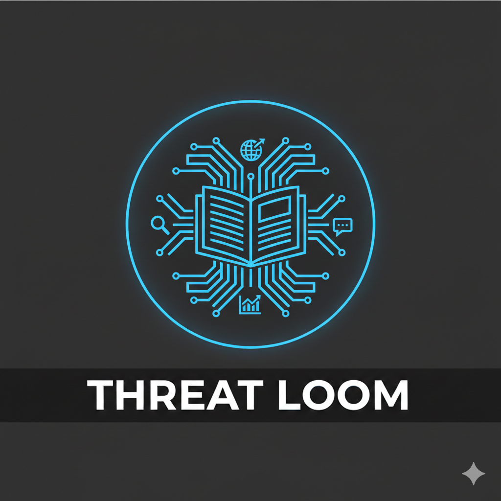

<p align="center">
  
</p>

# Threat Loom

AI-powered threat news analysis platform — aggregation, summarization, and forecasting.

Threat Loom automatically collects cybersecurity articles from RSS feeds and research libraries, generates structured AI summaries with MITRE ATT&CK mapping animation, and provides natural language search and trend forecasting over your collected data.

**[Documentation](https://nikhilh-20.github.io/ThreatLoom/)**

<video src="https://github.com/user-attachments/assets/f718a422-508c-40f5-b795-c62920710c6b" controls></video>

## Features

- **Feed Aggregation** — Ingests from 61 pre-configured security feeds (The Hacker News, BleepingComputer, Krebs on Security, CISA, AWS, Cisco, Google, etc.) plus Malpedia research. LLM-based relevance filtering removes noise. Feeds are centrally managed in `config.json.example`.
- **AI Summarization** — Produces structured summaries with executive overview, novelty assessment, technical details, mitigations, and 3-8 categorization tags aligned to MITRE ATT&CK. Supports OpenAI and Anthropic providers. Uses prompt caching to reduce token costs on repeated summaries.
- **Attack Flow Visualization** — Interactive kill chain timeline showing phase-by-phase attack sequences with MITRE tactic/technique mapping and progressive reveal.
- **Semantic Search** — RAG-powered chat interface. Ask questions in natural language and get answers grounded in your article database with citation cards.
- **Historical Trend Analysis** — Multi-pass LLM analysis generating quarter-by-quarter and year-by-year reports for each threat category, with cross-period correlation. Results are cached and displayed in collapsible panels.
- **Trend Forecasting** — Category-level trend + 3-6 month forecast. Drill into specific threat actors, malware families, and offensive tooling. Cost estimate shown before generation; actual cost shown after.
- **Time-Period Filter** — Filter the entire feed view and all category analysis by 24 h, 7 d, 30 d, or 90 d lookback with one click.
- **Email Notifications** — Per-article email alerts or configurable digest summaries (daily or weekly) with the full structured analysis (executive summary, novelty, details, mitigations) and links to original sources. Configure any SMTP provider (Gmail, Outlook, SendGrid). Uses only Python stdlib — no extra dependencies.
- **Pipeline Controls** — On-demand header buttons to trigger feed refresh (full or since last retrieval), generate embeddings for already-summarized articles, ingest specific article URLs without a full feed fetch, and abort a running pipeline between stages. Cost estimate shown before summarization; actual cost shown after.
- **Automatic Categorization** — Articles are sorted into 9 threat categories (Malware, Vulnerabilities, Threat Actors, Phishing, Supply Chain, etc.) with entity-level subcategories for 300+ MITRE ATT&CK groups and software families.

## Requirements

- Python 3.10+
- OpenAI API key (for summarization, embeddings, and intelligence search) **or** Anthropic API key (for summarization only; embeddings still require OpenAI)
- Malpedia API key (optional, for research article ingestion)

## Quick Start

### Clone and install

```bash
git clone https://github.com/nikhilh-20/ThreatLoom.git
cd ThreatLoom
python -m venv venv
```

Activate the virtual environment:

```bash
# Linux / macOS
source venv/bin/activate

# Windows
venv\Scripts\activate
```

Install dependencies:

```bash
pip install -r requirements.txt
```

### Windows one-click

Double-click `run.bat` — it creates a virtual environment, installs dependencies, and launches the app automatically.

### Docker

Copy `.env.example` to `.env` and fill in your credentials:

```bash
cp .env.example .env
# Edit .env with your API keys
docker compose up
```

The app will be available at `http://localhost:5000`. Data (database and config) persists in the local `./data` directory, shared between standalone and Docker modes.

Alternatively, pass credentials as environment variables:

```bash
OPENAI_API_KEY=sk-proj-your-key docker compose up
```

See [Environment variables](#environment-variables) below for all supported options.

### Run (without Docker)

```bash
python app.py
```

The app initializes the database, syncs feed sources, starts the background scheduler, and opens your browser to the dashboard (port 5000 by default, auto-selects next available if taken).

## Configuration

On first run, a `data/config.json` file is created with defaults from `config.json.example`. You can edit it directly or use the Settings page in the web UI. The default feeds list is maintained in `data/config.json.example` and merged into your config automatically — any new feeds added to the example file will appear on next startup.

```json
{
  "openai_api_key": "",
  "openai_model": "gpt-4.1-mini",
  "anthropic_api_key": "",
  "anthropic_model": "claude-haiku-4-5-20251001",
  "llm_provider": "openai",
  "fetch_interval_minutes": 30,
  "malpedia_api_key": "",
  "report_token": "",
  "feeds": [
    {"name": "The Hacker News", "url": "https://feeds.feedburner.com/TheHackersNews", "enabled": true},
    {"name": "BleepingComputer", "url": "https://www.bleepingcomputer.com/feed/", "enabled": true},
    ...
  ]
}
```

### Local development with `.env`

For local development, create a `.env` file in the project root (copy from `.env.example`):

```bash
cp .env.example .env
```

Then edit `.env` and add your API keys:

```bash
OPENAI_API_KEY=sk-proj-your-key-here
ANTHROPIC_API_KEY=sk-ant-your-key-here
MALPEDIA_API_KEY=your-malpedia-key
LLM_PROVIDER=openai
```

The app will automatically load these variables when starting. The `.env` file is in `.gitignore` and will never be committed to version control.

### Environment variables

API keys and server settings can be configured via environment variables, which take precedence over `config.json`. This is the recommended approach for Docker deployments.

| Variable | Default | Description |
|---|---|---|
| `OPENAI_API_KEY` | — | OpenAI API key (overrides `config.json`) |
| `ANTHROPIC_API_KEY` | — | Anthropic API key (overrides `config.json`; used when `llm_provider` is `anthropic`) |
| `LLM_PROVIDER` | `openai` | LLM provider: `openai` or `anthropic` |
| `OPENAI_MODEL` | `gpt-4.1-mini` | OpenAI model name (overrides `config.json`) |
| `ANTHROPIC_MODEL` | `claude-haiku-4-5-20251001` | Anthropic model name (overrides `config.json`) |
| `MALPEDIA_API_KEY` | — | Optional Malpedia API key (overrides `config.json`) |
| `HOST` | `127.0.0.1` | Bind address (`0.0.0.0` in Docker) |
| `PORT` | auto-detect | Listen port (`5000` in Docker) |
| `DATA_DIR` | `./data` | Directory for `config.json` and `threatlandscape.db` (`/app/data` in Docker) |
| `SMTP_HOST` | — | SMTP server hostname (e.g. `smtp.gmail.com`) |
| `SMTP_PORT` | `587` | SMTP server port |
| `SMTP_USERNAME` | — | SMTP login username |
| `SMTP_PASSWORD` | — | SMTP login password or app password |
| `NOTIFICATION_EMAIL` | — | Recipient email (auto-enables notifications when set) |

### Setting up your API key

1. Open the app and navigate to **Settings**
2. Select your LLM provider (**OpenAI** or **Anthropic**)
3. Enter your API key and click **Test** to verify
4. Select your preferred model (see tables below)
5. Click **Save Settings**

> **Report Token (optional):** Set `report_token` in `config.json` or via the Android app Settings → Reporting section to require a token when submitting LLM output reports via `POST /api/report`.

> Embeddings for semantic search always use OpenAI (`text-embedding-3-small`). An OpenAI key is required even when using Anthropic for summarization.

### Adding feeds

Add custom RSS/Atom feeds through the Settings page or directly in `config.json`. To add feeds that persist across new deployments, update `data/config.json.example` and they will be merged on next startup:

```json
{"name": "My Custom Feed", "url": "https://example.com/feed.xml", "enabled": true}
```

**For contributors:** New default feeds should be added to `data/config.json.example` to ensure all installations pick them up automatically on next run.

### Default feeds

The app includes 61 pre-configured feeds covering security news sites, research blogs, and independent security researchers. See `data/config.json.example` for the complete list. Key sources include:

- **News Outlets**: The Hacker News, BleepingComputer, Krebs on Security, SecurityWeek, Dark Reading, Threat Post
- **Vendor Research**: Sophos, Infosecurity, Palo Alto Networks, Cisco, AWS, Google, Kaspersky, SentinelOne
- **Government & Standards**: CISA Alerts, Cloud Security Alliance
- **Independent Researchers**: Troy Hunt, Schneier on Security, Graham Cluley, and others

All feeds are enabled by default. Disable any by setting `"enabled": false` in `config.json`.

### LLM models

**OpenAI**

| Model | Best for |
|---|---|
| `gpt-4.1-mini` | Fast, cost-effective (default) |
| `gpt-5-mini` | Higher quality summaries with faster inference |

**Anthropic**

| Model | Best for |
|---|---|
| `claude-haiku-4-5-20251001` | Daily use — fast, cost-effective (default) |
| `claude-sonnet-4-6` | Higher quality summaries and insights |
| `claude-opus-4-6` | Highest quality, complex analysis |

Embeddings always use `text-embedding-3-small` (1536 dimensions) regardless of provider.

## How It Works

The app runs an automated pipeline on a configurable interval (default: every 30 minutes). You can also trigger it manually from the dashboard.

```
RSS Feeds / Malpedia
       |
 Relevance Filter (LLM batch classification)
       |
 Scrape Article Content (trafilatura)
       |
 AI Summarization (structured JSON → markdown)
       |
 Email Notification (per article, if enabled)
       |
 Vector Embeddings (text-embedding-3-small)
       |
 Browse · Search · Forecast
```

**Pipeline stages:**

1. **Fetch** — Download RSS/Atom entries from enabled feeds, filter by date, deduplicate by URL, batch-classify relevance via LLM
2. **Malpedia** — Parse BibTeX bibliography, same relevance filtering (requires API key)
3. **Scrape** — Download article HTML using browser-like headers, extract text with trafilatura (30s timeout per article)
4. **Cost Gate** — Estimate API cost and prompt for confirmation before summarization; pipeline can be aborted here
5. **Summarize** — Generate structured summary with executive overview, novelty, details, mitigations, tags, and attack flow (12,000 char input limit)
6. **Notify** — Send email alert with the full analysis for each summarized article (if enabled; failures never block the pipeline)
7. **Embed** — Generate 1536-dim vectors for semantic search (batches of 50)

Each stage only processes new/unprocessed articles. The pipeline is non-blocking — browse while it runs.

## Project Structure

```
app.py                # Flask web server, all routes and API endpoints
config.py             # Configuration loading/saving (config.json)
database.py           # SQLite interface, schema, categorization engine
scheduler.py          # Background pipeline orchestration (APScheduler)
feed_fetcher.py       # RSS/Atom feed ingestion with relevance filtering
malpedia_fetcher.py   # Malpedia BibTeX research ingestion
article_scraper.py    # HTML download and text extraction (trafilatura)
summarizer.py         # LLM summarization, relevance checks, trend/forecast insights
llm_client.py         # LLM provider abstraction (OpenAI and Anthropic)
cost_tracker.py       # Per-session token and cost tracking
notifier.py           # Email notifications via SMTP (stdlib only)
embeddings.py         # Vector embedding generation and cosine similarity search
intelligence.py       # RAG chat system (retrieval + LLM response)
mitre_data.py         # MITRE ATT&CK entity lookup tables
requirements.txt      # Python dependencies
run.bat               # Windows one-click launcher
Dockerfile            # Container image definition
docker-compose.yml    # Docker Compose service config
data/
  config.json         # User configuration (created on first run)
  config.json.example # Default feeds list (single source of truth)
  threatlandscape.db  # SQLite database (created on first run)
templates/            # Jinja2 HTML templates (dashboard, article, intelligence, settings)
static/               # CSS (dark theme), JavaScript (client-side logic), and images
docs/                 # MkDocs documentation source
mkdocs.yml            # MkDocs configuration
```

## API Endpoints

All endpoints return JSON. Base URL: `http://127.0.0.1:<port>`

### Articles

| Method | Endpoint | Description |
|---|---|---|
| GET | `/api/articles` | Paginated article list (params: `source_id`, `search`, `tag`, `page`, `limit`) |
| GET | `/api/articles/<id>` | Single article with full summary |
| GET | `/api/articles/categorized` | Articles grouped by threat category (params: `days`) |
| DELETE | `/api/articles/<id>/summary` | Remove an article's AI summary and embeddings |
| GET | `/api/available-tags` | List all distinct tags present in the database |
| PATCH | `/api/articles/<id>/tags` | Update the tags on a specific article (body: `{"tags": [...]}`) |

### Sources & Stats

| Method | Endpoint | Description |
|---|---|---|
| GET | `/api/sources` | All configured feed sources |
| GET | `/api/stats` | Database statistics (articles, sources, summaries, pending/failed counts, has_api_key) |

### Pipeline Control

| Method | Endpoint | Description |
|---|---|---|
| POST | `/api/refresh` | Trigger manual pipeline (body: `{"days": 1, "since_last_fetch": false}`) |
| GET | `/api/refresh-status` | Poll pipeline status (stage, cost estimate, abort state) |
| POST | `/api/abort` | Abort the running pipeline between stages |
| POST | `/api/embed` | Generate embeddings for all summarized articles that don't have one yet |
| POST | `/api/ingest-urls` | Scrape and summarize specific article URLs without a full feed fetch |
| POST | `/api/clear-db` | Delete articles/summaries; body `{"days": N}` limits to articles older than N days (0 = all) |
| POST | `/api/send-digest` | Trigger digest email immediately, bypassing scheduled time |
| POST | `/api/cost/approve` | Approve the summarization cost estimate and continue the pipeline |
| POST | `/api/cost/decline` | Decline the cost estimate; pipeline aborts at the confirm stage |
| POST | `/api/cost/dismiss` | Dismiss the post-run actual cost notification |

### Categories & Insights

| Method | Endpoint | Description |
|---|---|---|
| GET | `/api/subcategories` | Entity breakdown within a category (params: `category`, `limit`, `days`) |
| GET | `/api/category-insight` | Trend + 3-6 month forecast (params: `category`, `subcategory`, `days`) |
| GET | `/api/trend-analysis` | Historical quarterly + yearly trend analysis (params: `category`, `subcategory`, `days`) |
| GET | `/api/insight-estimate` | Cost estimate before generating insight or trend (params: `category`, `subcategory`, `days`, `type`) |

### Intelligence

| Method | Endpoint | Description |
|---|---|---|
| POST | `/api/intelligence/chat` | RAG chat (body: `{"messages": [{"role": "user", "content": "..."}]}`) |
| POST | `/api/intelligence/search` | Semantic search (body: `{"query": "...", "top_k": 15}`) |
| GET | `/api/intelligence/status` | Embedding index statistics |

### Settings

| Method | Endpoint | Description |
|---|---|---|
| POST | `/api/settings` | Save configuration (including email notification settings) |
| POST | `/api/test-key` | Validate OpenAI API key |
| POST | `/api/test-anthropic-key` | Validate Anthropic API key |
| POST | `/api/test-malpedia-key` | Validate Malpedia API key |
| POST | `/api/test-email` | Send test email notification (accepts SMTP settings in body) |
| POST | `/api/report` | Send an LLM output report email to the developer (body: `{"type", "identifier", "llm_content", "metadata", "user_note", "token"}`) |

## Database

SQLite with WAL mode. Seven tables:

- **sources** — Feed definitions and last-fetched timestamps
- **articles** — Ingested articles (title, URL, author, date, scraped content, image)
- **summaries** — AI summaries, tags (JSON), attack flow (JSON), model used
- **article_embeddings** — 1536-dim float32 vectors stored as BLOBs
- **category_insights** — Cached trend/forecast text with hash-based invalidation (24h TTL)
- **trend_analyses** — Cached quarterly and yearly historical trend reports with hash-based invalidation
- **article_correlations** — Relationships between related articles

Article deduplication is enforced by a UNIQUE constraint on URL. Thread-local connections ensure safe concurrent access from Flask, the scheduler, and the scraper thread pool.

## Documentation

Full documentation is available via MkDocs:

```bash
pip install mkdocs-material
mkdocs serve
```

Then open `http://localhost:8000`. Topics covered: architecture, configuration reference, feature deep-dives, full API reference, database schema, and contributing guide.

To deploy to GitHub Pages:

```bash
mkdocs gh-deploy
```

## Tech Stack

| Component | Technology |
|---|---|
| Web framework | Flask |
| Feed parsing | feedparser (with socket timeout protection) |
| Content extraction | trafilatura |
| AI / LLM | OpenAI (GPT-4.1-mini/5-mini, text-embedding-3-small), Anthropic (Claude Haiku/Sonnet/Opus) |
| LLM Optimization | Prompt caching (reduced token costs on repeated summaries) |
| Scheduling | APScheduler |
| Database | SQLite (WAL mode) |
| Vector search | numpy (cosine similarity) |
| Frontend | Vanilla JS, marked.js (markdown rendering) |
| Threat taxonomy | MITRE ATT&CK (groups, software, techniques) |

## Disclaimer

This tool was fully generated by [Claude Code](https://claude.ai/claude-code) (Anthropic). It is provided strictly for **educational and informational purposes**. Any use of this tool for malicious purposes is expressly prohibited and may violate applicable laws. The author is not responsible for any misuse of this tool. The author provides this tool **"AS-IS" without warranty of any kind**, express or implied, and shall not be liable for any damages or consequences resulting from its use.

The Threat Loom logo was created by [Nano Banana](https://gemini.google/overview/image-generation/) using Gemini image generation.

## License

BSD-3-Clause
